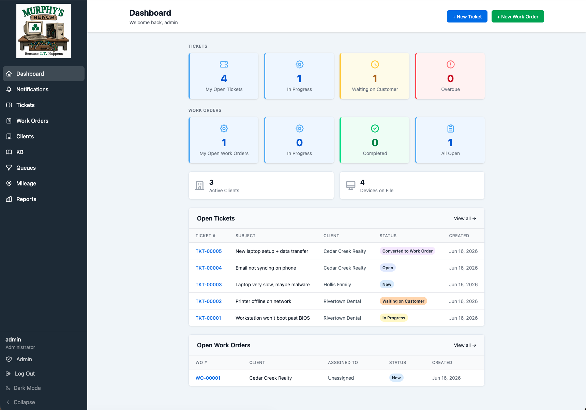
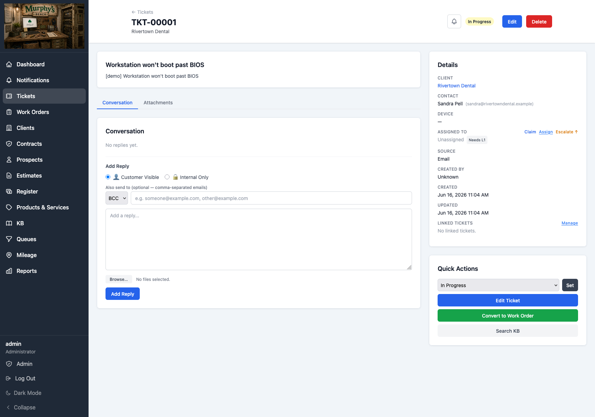
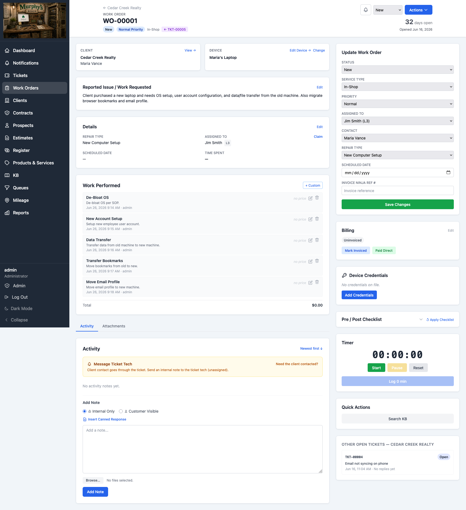
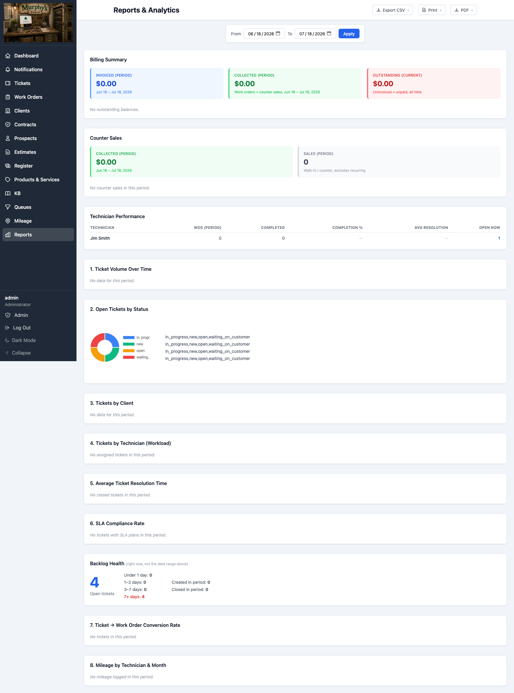
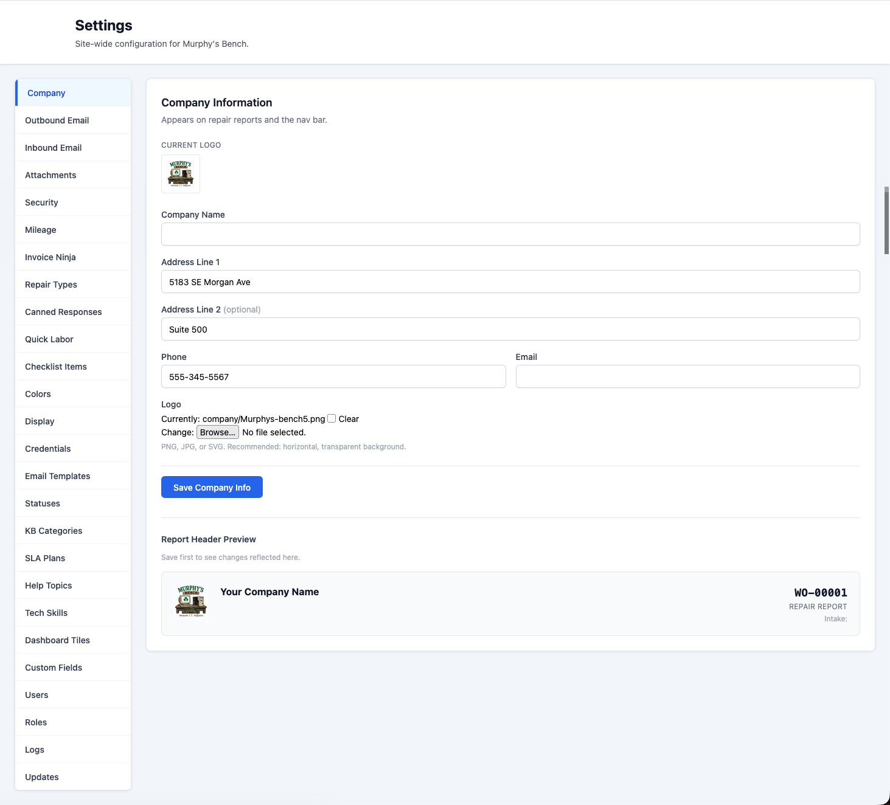
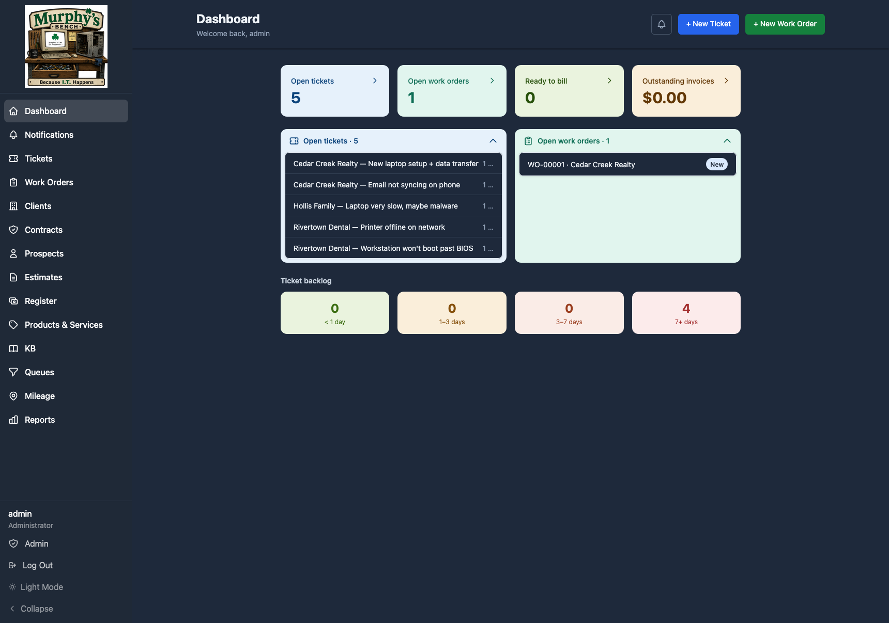
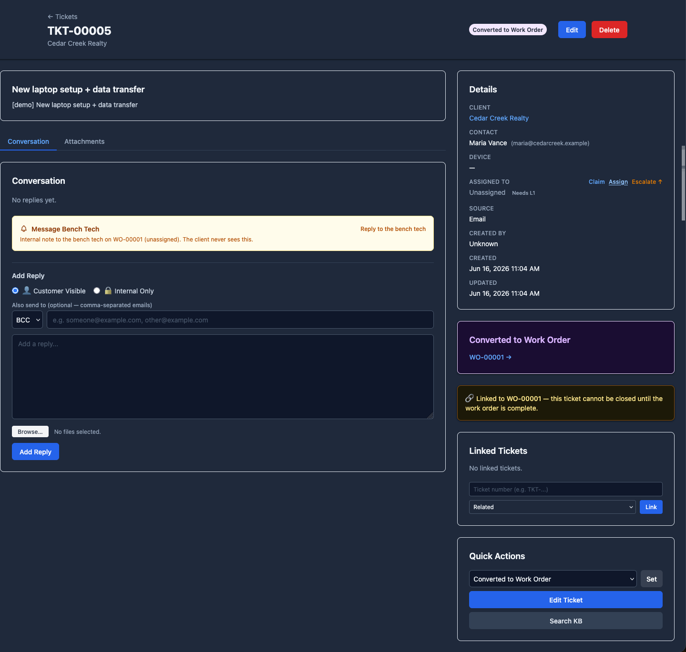
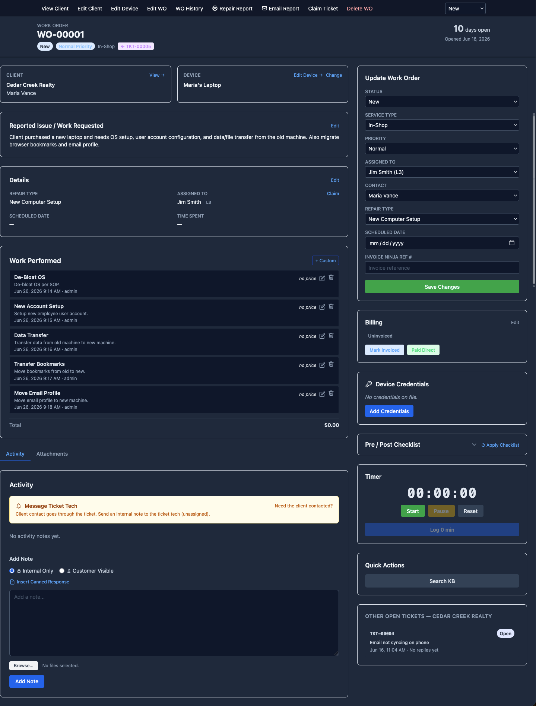

# Murphy's Bench

**A self-hosted ticketing + work-order tracker for small computer-repair and field-service shops.**

Murphy's Bench is the operational core of a one-or-few-person repair shop: a customer
emails or calls, you open a **ticket**, triage it, convert it to a **work order** on the
bench, track the repair (checklists, time, parts, device specs, mileage), print a repair
report, and push the priced work to your invoicing system. It runs on **your** server, on
your network — no per-seat fees, no SaaS subscription, no one else holding your client data.

It's shaped like RepairShopr or Syncro — but **free, self-hosted, and focused on the work at
the bench.**

> **Honest status:** Murphy's Bench runs in **daily production at one shop** and is actively
> developed there. If you adopt it today you're an **early self-hoster** rather than a
> customer — see **Today, and where it could go** below for an honest picture of where it is.

---

## What it is

- **Tickets** — threaded email in/out, SLA timers, help topics, saved queues, custom fields,
  escalation levels + per-tech visibility scoping.
- **Work orders** — the repair bench: pre/post checklists, a stopwatch/time log, parts +
  labor line items, device spec snapshots ("as-serviced"), a printable repair report, and
  one-click ticket → work-order conversion.
- **Client-centric** — clients, contacts, and devices all hang off the client, the way a
  shop actually works.
- **Quotes & estimates** — build a priced estimate (with side-by-side comparative options),
  email it to the customer as a PDF, and accept it straight into a work order. Sales leads
  ("prospects") get captured up front and promote to a full client when they say yes.
- **Register & payments** — a **light point-of-sale register** settles a finished work order
  or a walk-in counter sale: record cash/check (or a card you ran in Square), or trigger a
  charge against a client's **card on file**, then print an MB receipt with the transaction
  reference. The invoice is pushed to **[Invoice Ninja](https://invoiceninja.com/)**, which
  stays the system of record. Managed clients can be billed **monthly (recurring)**. MB never
  stores or processes card data itself and is not an accounting package.
- **Encrypted credential vaults** — org-level and per-device username/password storage
  (AES-256) with a full access log.
- **The rest** — knowledge base (Markdown), reporting with CSV export, roles/permissions,
  TOTP two-factor auth, an audit log, dark mode, an in-app notification bell, and internal
  tech-to-tech messaging.
- **Runs itself quietly** — nightly off-site backups (consistent SQLite snapshot →
  object storage), and self-monitoring that turns its own failures (a failed job, a 500, a
  full disk, a backup that didn't run) into a ticket so you find out before your customers do.

## What it's not

It's deliberately **not** a giant MSP suite, a full retail POS, or an accounting platform. In particular, it isn't:

- a **full retail POS** — it has a *light* register for settling repairs and counter sales, but there's no cash drawer, barcode scanning, or split tender
- a **payment processor** — MB never stores or charges cards itself; card money moves through Square/Invoice Ninja, MB just records it
- full inventory management (no stock levels or parts ordering)
- an accounting package — [Invoice Ninja](https://invoiceninja.com/) stays the system of record for invoicing and payments
- a customer self-service portal
- a hosted SaaS product
- a replacement for QuickBooks, Square, or Invoice Ninja

Some of these (parts/inventory especially) may grow later — but the focus today is the ticket → bench → invoice → get-paid workflow.

## Today, and where it could go

Right now Murphy's Bench does the **ticket → repair → quote → invoice → get-paid** core, and
does it well — that's what it's built around. It's young and shaped by the one shop running it,
so a few things are worth saying plainly:

- **You host it yourself.** That's deliberate — your client data stays on your own server and
  network, not in someone else's cloud.
- **It's early.** One shop runs it in daily production. Adopt it now and you're an early
  adopter, not a customer — expect rough edges.
- **Invoicing currently goes to [Invoice Ninja](https://invoiceninja.com/)** — that's what I
  use, so it's what's wired up first. Other targets (QuickBooks and the like) make good sense
  down the road; they just aren't built yet.
- **Plenty isn't built yet** — things like parts inventory and ordering, SMS notifications, a
  customer portal, other invoicing back-ends (QuickBooks and the like), or deeper documentation.
  Honestly, I don't yet know which of these matter most to other shops — so if something would
  make MB genuinely useful to yours, **tell me.** That's how it'll get shaped.

**Support, honestly:** it's maintained by one working technician in spare time. Issues and PRs
are welcome and read, but replies are best-effort, and there's **no warranty — run it at your
own risk** (see the license). Keeping support light on purpose is what keeps a one-person
project alive.

## Who it's for

Murphy's Bench may be a fit if you're:

- a solo repair technician or a small computer-repair shop
- a small field-service operation
- someone who wants repair-workflow software without SaaS pricing
- comfortable self-hosting a Django app

It's probably **not** for you if you need enterprise MSP automation, a polished hosted
product, a full retail POS, deep inventory, or guaranteed support.

---

## Screenshots

**Dashboard** — your ticket and work-order queues at a glance.

**Ticket detail** — threaded conversation, the linked work order, and quick actions.

**Work order** — the repair bench: reported issue, device, priced labor/parts, a stopwatch, pre/post checklist, and encrypted credentials.

**Reports & analytics** — billing summary, ticket volume, and ticket→work-order conversion, with CSV/PDF export.

**Settings** — everything is configured in-app through a native settings UI; no Django admin needed.

**Dark mode** — every page has a light and dark theme.

_(Screenshots use demo data.)_

## Tech stack

Python 3.12 · Django 5.2 LTS · HTMX + Alpine.js + Tailwind — **all self-hosted, no CDN** (Tailwind
is compiled to a static stylesheet via the standalone CLI on deploy; no Node) · SQLite
(single file, no DB server) · Gunicorn + Nginx. It runs **behind a
TLS-terminating reverse proxy** (Cloudflare Tunnel, Caddy, or Nginx) rather than terminating
TLS itself — the standard Django model; see [`docs/deployment-tls.md`](docs/deployment-tls.md). A
Content-Security-Policy is enforced in front of the app.

## Install

A fresh install onto Ubuntu 24.04 is documented step-by-step in
**[INSTALL.md](INSTALL.md)** (system packages → app → `.env` → database → Gunicorn/Nginx →
optional Cloudflare tunnel → scheduled jobs). Self-monitoring and log rotation are in
[`deploy/README.md`](deploy/README.md) → Observability.

## Backup & restore

MB ships a fail-loud backup script (`scripts/mb_backup.sh`): a consistent SQLite snapshot
plus attachments and `.env`, bundled and pushed off-site to object storage (S3/B2), with an
optional [healthchecks.io](https://healthchecks.io/) dead-man's-switch so a backup that
silently stops running becomes an alert. Restore = untar the bundle and drop the database
file back in place — **you also need your `FIELD_ENCRYPTION_KEY`** to decrypt stored
credentials, so keep it in a password manager. Details in [`deploy/README.md`](deploy/README.md).

## License

Murphy's Bench is licensed under the **GNU Affero General Public License v3.0** — see
[LICENSE](LICENSE). You're free to use, self-host, and modify it; if you distribute a modified
version, or run one as a network service, you must make your changes available under the same
license. (No warranty of any kind.)

Copyright © 2026 Mike McCall

---

*Built by a working technician for a working bench. If it's useful to your shop too, great —
but it earns its keep at one shop first.*
