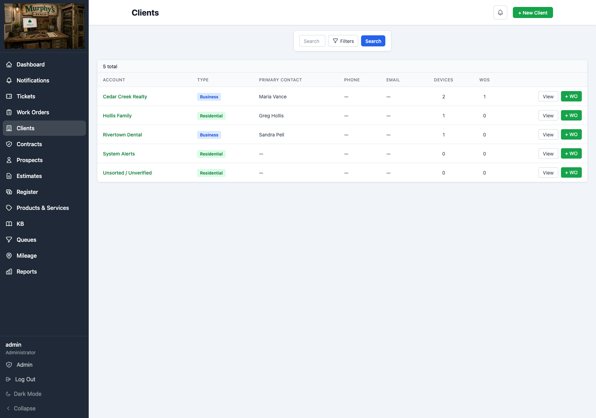
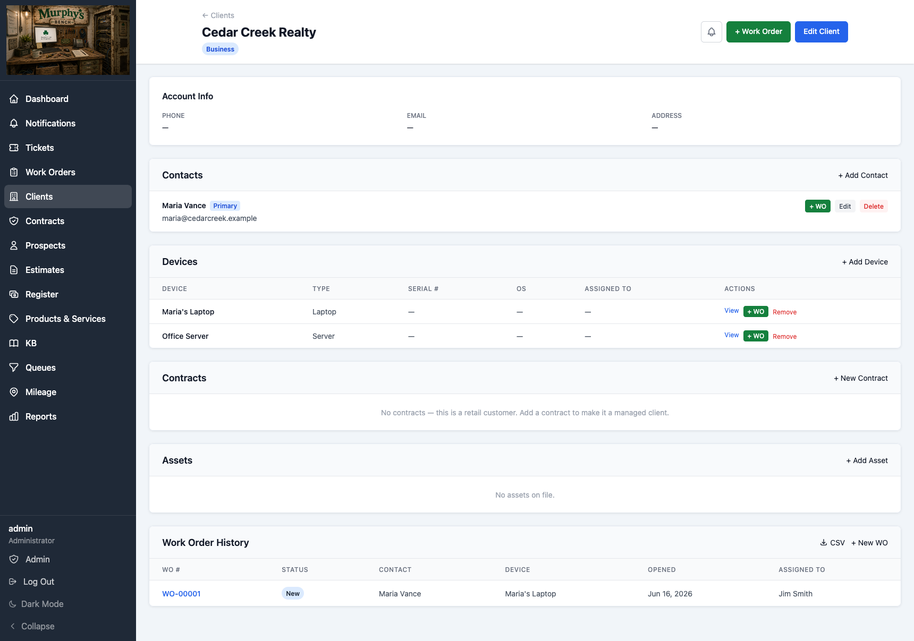
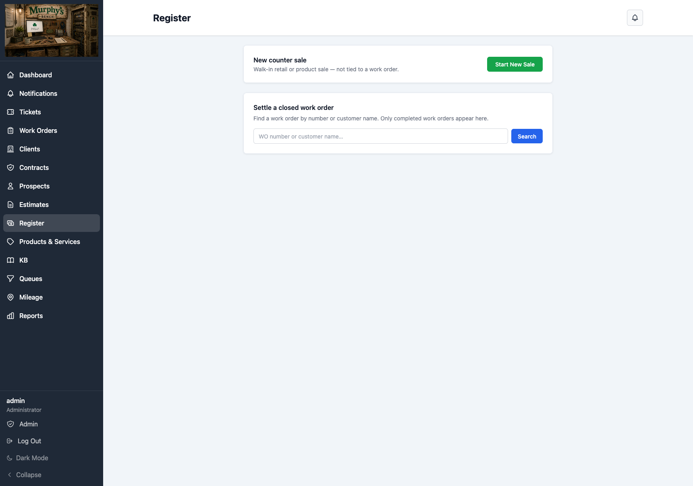

# Murphy's Bench

**A self-hosted ticket and work-order system for small computer repair and field-service shops.**

Murphy's Bench is the tool I use to run my own shop.

A customer calls or emails, it becomes a ticket, the job moves to a work order, the work gets tracked, the report gets printed or emailed, and the bill gets pushed to Invoice Ninja. That is the center of the project. It is not meant to be everything a repair shop could ever need. It is meant to cover the work that happens every day without turning into another monthly bill or another vendor holding the customer data.

It runs on your own server, with SQLite, Django, HTMX, Alpine, and plain old server-rendered pages. No SaaS account. No per-seat pricing. No hosted database sitting somewhere else.

> **Current status:** Murphy's Bench is in daily production at one shop and is still being built there. If you try it now, treat it like an early self-hosted project, not a finished commercial product.

---

## What It Does

Murphy's Bench handles the repair workflow I actually needed:

- tickets from customer emails and phone calls
- threaded customer replies and internal notes
- ticket to work-order conversion
- clients, contacts, and devices
- work orders with checklists, labor, parts, time tracking, device notes, mileage, and repair reports
- estimates and quotes, including prospects that do not become clients until the work is accepted
- a small Register for settling completed work orders and walk-in counter sales
- Invoice Ninja handoff for invoices and payments
- managed clients: service contracts, managed assets, and cadence-based recurring billing
- encrypted device and organization credentials
- a Markdown knowledge base
- reports with CSV/PDF export
- roles, MFA, audit logs, notifications, dark mode, and self-monitoring

The Register is there because a finished job has to get paid. It can record cash, check, a card you ran somewhere else, or trigger a client's saved card in Invoice Ninja. Murphy's Bench does not store cards and does not process payments itself. Invoice Ninja remains the billing record.

Invoice Ninja is the billing backend today because it's what my shop runs. The integration sits behind a deliberate seam — MB records every transaction itself regardless of backend — so other billing/payment backends can be added without rebuilding the app around them. That's planned, not built yet: right now Invoice Ninja is the one that works.

## What It Is Not

Murphy's Bench is not trying to be:

- a full retail POS
- a payment processor
- an accounting package
- a hosted SaaS product
- a customer portal
- a complete inventory system
- a replacement for QuickBooks, Square, or Invoice Ninja

There is a Register, but there is no cash drawer, barcode scanner, split tender, or retail inventory workflow. Parts can be billed on work orders today, but stock tracking and ordering are not built yet. Managed clients' machines can be tracked as assets, but that is device tracking, not parts/stock inventory.

That may change later. Parts and inventory probably need to exist if the project is going to fit more shops. But the priority today is still the ticket -> work order -> invoice -> paid path.

## Why I Built It

I wanted something small enough to understand and run myself, but complete enough that it could handle the day without a spreadsheet taped to the side of it.

Most shop software either wants to be an MSP platform, a retail POS, or a hosted subscription. Murphy's Bench is more modest than that. It is for the bench, the inbox, the customer record, the device history, and the handoff to billing.

The point is not to replace every tool in the shop. The point is to own the workflow that sits between "customer needs help" and "this job is done and billed."

## Today

This is working software, but it is young.

It runs in production for my shop. It has tests, backups, restore tooling, security hardening, a CI gate, and enough operational work behind it that I trust it for my own business. That does not mean it is polished for everyone else yet.

If you self-host it, expect to read the docs, manage your own server, and make judgment calls. Issues and pull requests are welcome, but support is best-effort. I am one technician building this around real shop work.

Things I plan to build but haven't yet:

- stock levels, reorder points, and parts purchasing (parts can be billed on a work order today, but there's no stock tracking behind them)
- billing/payment backends other than Invoice Ninja — the seam for them exists; the other implementations don't
- a management "dig-in" reporting layer (the dashboard is the glance; deeper reporting is coming)
- SMS
- a customer self-service portal
- deeper user-facing documentation
- broader testing outside my own shop's workflow

These are direction, not promises with dates — I build this around real shop work, in the time I have. If one of them is the thing that would make Murphy's Bench useful to your shop, say so. That is how the project will grow.

## Who It Might Fit

Murphy's Bench may be worth a look if you:

- run a solo or small repair shop
- do computer repair, field service, or small managed-client work
- are comfortable self-hosting a Django app
- want your customer and credential data on your own system
- use Invoice Ninja, or are willing to use it for billing

It is probably the wrong fit if you need a polished hosted product, enterprise MSP automation, a full retail POS, deep inventory, or guaranteed support.

---

## Screenshots

**Dashboard** - your ticket and work-order queues at a glance.

**Ticket detail** - threaded conversation, the linked work order, and quick actions.

**Work order** - reported issue, device, priced labor/parts, time tracking, checklist, and encrypted credentials.

**Clients** - accounts, contact info, and device/work-order counts at a glance.

**Client detail** - contacts, devices, contracts/assets for managed clients, and work order history.

**Register** - settle a completed work order or start a new counter sale.

**Reports** - billing summary, ticket volume, ticket-to-work-order conversion, and export options.

**Settings** - most configuration lives in the app, not in Django admin.

**Dark mode** - every page has a light and dark theme, toggled per-user.

_(Screenshots use demo data.)_

## Tech Stack

- Python 3.12
- Django 5.2 LTS
- HTMX + Alpine.js
- Tailwind, compiled locally with the standalone CLI
- SQLite
- Gunicorn + Nginx
- Invoice Ninja for billing

The frontend is self-hosted. There is no CDN requirement. The app is built to run behind a TLS-terminating reverse proxy such as Cloudflare Tunnel, Caddy, or Nginx. See [docs/deployment-tls.md](docs/deployment-tls.md).

A Content-Security-Policy middleware is included. The repo default is report-only so a fresh install does not break unexpectedly; production/demo deployments flip `CSP_REPORT_ONLY=False` after validation.

## Install

One command (`scripts/setup.sh`) takes a fresh Ubuntu 24.04 box to a working login page on your local network — system packages, the app, the database, and the web server, all done. See [INSTALL.md](INSTALL.md) for that, plus what to do if your box doesn't fit the common case, and how to go public later if you ever need to.

## Backup And Restore

Murphy's Bench includes a backup script at `scripts/mb_backup.sh`. It takes a consistent SQLite snapshot, includes attachments and `.env`, and ships the bundle to one or both admin-configured destinations — an onsite NAS/network share (SMB) and/or an S3/B2-compatible bucket — each on its own schedule and retention (Settings → Maintenance → Backups). The VM itself is never a backup destination; the local copy is transient staging, deleted once it ships.

Restore is intentionally plain: put the database and files back where they belong. The important warning is the encryption key. If you lose `FIELD_ENCRYPTION_KEY`, encrypted credentials cannot be recovered from backup. Keep that key somewhere safe.

More detail is in [deploy/README.md](deploy/README.md).

## License

Murphy's Bench is licensed under the GNU Affero General Public License v3.0. See [LICENSE](LICENSE).

You can use it, self-host it, and modify it. If you distribute a modified version, or run a modified version as a network service, the AGPL requires you to make those changes available under the same license.

No warranty. Use it at your own risk.

Copyright (c) 2026 Shamrock Computer Services LLC

---

Built for my own bench first. If it helps yours too, good.
